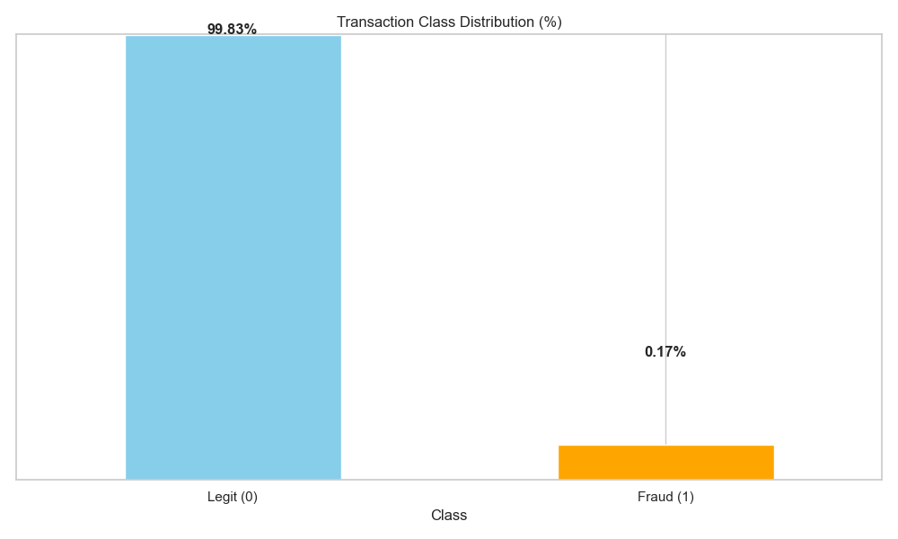

# 🛡️ Credit Card Fraud Detection — ML Case Study

This is a practical Data Science/ML project that investigates the detection of fraudulent credit card transactions using a real-world dataset from [Kaggle](https://www.kaggle.com/datasets/mlg-ulb/creditcardfraud). The goal is not just to classify transactions, but to prioritize high-risk cases effectively under real-world constraints, where fraud is extremely rare and false positives are costly.

⸻
## 📦 Dataset

- Source: [Kaggle Credit Card Fraud Dataset](https://www.kaggle.com/datasets/mlg-ulb/creditcardfraud)
- Size: 284,807 transactions, 492 frauds (~0.17%)
- Features: PCA-transformed numerical variables (`V1` to `V28`), `Time`, `Amount`, `Class` (target: 0 = legit, 1 = fraud)

## 📊 Problem Statement

### 🧠 Rethinking Fraud Detection: It’s Not About Accuracy — It’s About Prioritization Under Uncertainty

Most fraud detection systems fail—not because they lack data or computing power, but because they optimize for the wrong thing. In high-volume environments like credit card networks, the real challenge isn’t prediction, it’s prioritization.

You’re not trying to classify every transaction perfectly. You’re trying to elevate the few critical cases where intervention actually matters—despite limited signal, overwhelming noise, and asymmetric cost.

⸻

### 🎯 The Real Objective: Risk-Sensitive Triage, Not Binary Classification

A fraud detection system isn’t a yes/no engine. It’s a risk triage system—ranking transactions by their likelihood of being fraudulent and enabling actionable thresholds based on operational trade-offs.

In this context:
* A “missed fraud” can mean financial loss, reputational damage, or regulatory penalties.
* A “false alarm” is just an inconvenient flag—tolerable up to a point.

So the goal shifts from maximizing accuracy to optimizing intervention impact under strict false-positive constraints.

⸻

### 📚 Theory-Aligned Modeling Approach

This requires models and evaluation strategies designed for:
* Extreme class asymmetry
* Decision prioritization
* Cost-aware intervention

Rather than:

`“How well can we classify fraud?”`

Ask:

`“How effectively can we surface the top 0.1% riskiest cases with acceptable noise?”`

⸻

#### Key Principles:
1. Rank-based Evaluation
    * Use precision-recall curves to evaluate performance across decision thresholds.
	* Prioritize PR-AUC, not ROC-AUC, for model selection.
2.	Threshold-Aware Metrics
	* Pick a working threshold that aligns with operational tolerance for false positives.
	* Measure F1, recall, and precision at that point.
3.	Probability Calibration
	* Don’t rely on raw scores—calibrate your outputs (e.g., Platt scaling, isotonic regression) so they reflect true intervention likelihood.
4.	Risk Framing over Classification
	* Use models that output well-ranked risk scores, not just class predictions.
	* Gradient boosting and anomaly detection models often excel here.

⸻

### 📌 Bottom Line

You don’t need a perfect classifier — you need a reliable, rank-aware signal that enables smart intervention. That’s where true impact lies in fraud detection.

---

## 🧠 Theoretical Framework: Hybrid Fraud Detection

### 🎯 Problem Definition

* We have a highly imbalanced binary classification problem: Legitimate ≫ Fraudulent (≈0.17%).  it is required to:

	1.	Detect rare frauds with minimal false positives.

	2.	Work under uncertainty (labels may lag, new fraud patterns emerge).

	3.	Provide a prioritization signal — not just a binary classifier.

### 🧭 Solution Strategy: Hybrid Anomaly Detection

Combine:

* Unsupervised anomaly detection (Isolation Forest) — detects unknown fraud patterns, no label needed.

* Supervised learning — learns from known frauds and real transaction history.

* Threshold tuning + PR-AUC/F1 metrics — ensures real-world deployment value.

           Raw Data (creditcard.csv)
                    |
           ┌────────▼────────┐
           │  Preprocessing  │  (Standardize, clean)
           └────────┬────────┘
                    │
           ┌────────▼────────┐
           │  IsolationForest│  (unsupervised)
           └────────┬────────┘
                    │
           ┌────────▼────────┐
           │  Add Anomaly    │
           │     Scores      │
           └────────┬────────┘
                    │
           ┌────────▼────────┐
           │ Supervised Model│
           └────────┬────────┘
                    │
           ┌────────▼────────┐
           │  Threshold Tune │ (PR/F1/ConfMatrix)
           └────────┬────────┘
                    ▼
              Deployment / Reporting

## 🔍 Preprocessing

**Input Dataset:**
- Features: `Time`, `Amount`, `V1–V28`, `Class`
- Fraud Rate: ~0.17%

**Steps:**
- Scaled `Time` and `Amount` into `normTime`, `normAmount`
- Retained anonymized PCA components
- Verified class imbalance and explored feature distributions

**Output:**
- `processed dataset`

---

## 📊 Exploratory Data Analysis (EDA)

EDA focused on understanding the distribution of transaction features and the nature of fraud cases.

**Highlights:**
- Confirmed severe class imbalance
- Explored `Amount`, `Time`, and PCA components
- Compared feature distributions for fraud vs. legit cases

**Visuals:**

----

---
## 🧪 Unsupervised Modeling — Isolation Forest

**What it is:**
Isolation Forest isolates points by randomly selecting features and splitting values. Anomalies are isolated quicker due to their uniqueness.

**Pros:**
- Label-free detection
- Fast and scalable

**Cons:**
- Sensitive to sparse regions
- Doesn't use true fraud labels

**Setup:**
- Input: Preprocessed dataset
- Model: `IsolationForest(n_estimators=100, contamination='auto')`
- Outputs:
  - `anomaly_score` (continuous)
  - `predicted` (binary flag)

**Artifacts:**
- `isoforest_scored.csv`

**Visuals:**
- `isoforest_score_hist.png`: Distribution of anomaly scores
- `isoforest_pr_curve.png`: Precision-recall of anomaly predictions
- `isoforest_confusion_matrix.png`: Isolation Forest fraud catch performance

---
## ➕ Augmenting with Anomaly Scores

**Purpose:**
Inject `anomaly_score` as an additional feature in supervised learning to enrich feature space.

**Input:** `processed_creditcard.csv + anomaly_score`
**Output:** Augmented dataset with `anomaly_score` as a new column

---
## 🌲 Supervised Modeling — Random Forest

**Model:** `RandomForestClassifier(n_estimators=100, class_weight='balanced')`

**Pros:**
- Robust against overfitting
- Handles feature interactions well

**Cons:**
- Less interpretable
- Slower in large-scale deployment

**Input:**
- All features + `anomaly_score`

**Output:**
- Trained model: `rf_model.joblib`
- Evaluation data: `X_test.csv`, `y_test.csv`, `y_probs.npy`

**Visuals:**
- `rf_confusion_matrix.png`: Confusion matrix at threshold=0.5
- `rf_pr_curve.png`: PR curve for classifier probabilities
- `rf_feature_importance.png`: Feature ranking by Gini importance
- `rf_classification_report.txt`: Raw metrics export

---
## 🎯 Threshold Tuning

**What it is:**
Rather than predicting fraud if probability > 0.5, we evaluate different thresholds to optimize recall or F1 score.

**Input:** `y_probs`, `y_test`

**Processing:**
- Precision–Recall analysis
- Threshold vs F1 plotting
- Confusion matrix generation

**Output:**
- Tuned threshold
- Final metrics at best threshold

**Visuals:**
- `threshold_vs_metrics.png`: Precision/Recall/F1 vs threshold
- `final_confusion_matrix_thresh.png`: Confusion matrix @ tuned threshold
- `final_report_threshold_tuned.txt`: Report with new metrics

---

## 📤 Deployment and Reporting

**Artifacts saved:**
- Models in `/models`
- Data splits and scores in `/data`
- Visualizations and logs in `/assets`

**Use cases:**
- Batch scoring pipeline
- Streamlit dashboard
- Reporting via automated summaries or plots

---

## 📈 Key Results

| Metric                | Value (Default 0.5) | Value (Tuned Threshold) |
|-----------------------|---------------------|--------------------------|
| Precision (Fraud)     | 0.9620              | 0.9318                   |
| Recall (Fraud)        | 0.7755              | 0.8367                   |
| F1 Score (Fraud)      | 0.8588              | 0.8817                   |
| PR AUC                | 0.8602              | 0.8602                   |

> Tuning improved recall and F1 score while trading off a minor precision loss — suitable when minimizing false negatives is the priority.

----